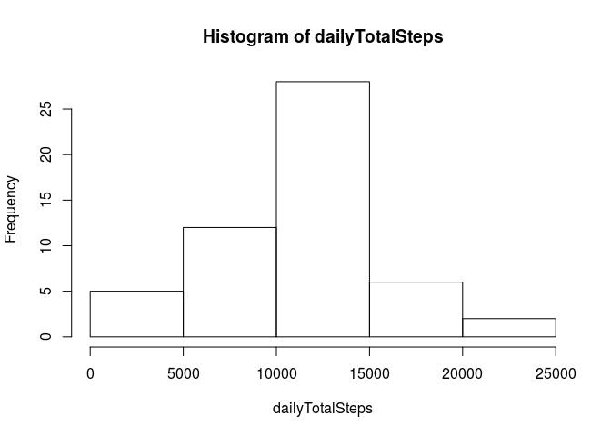
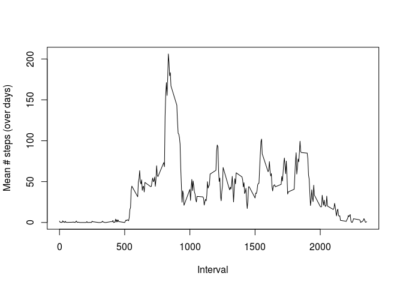
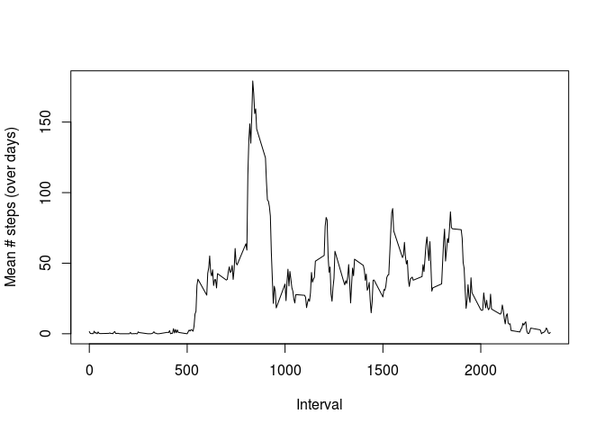
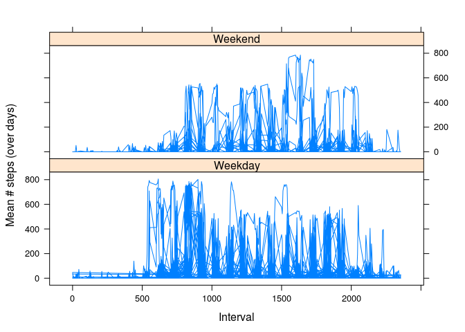

# Reproducible Research: Peer Assessment 1


```r
# load necessary libraries
library(dplyr)
```

```
## 
## Attaching package: 'dplyr'
## 
## The following object is masked from 'package:stats':
## 
##     filter
## 
## The following objects are masked from 'package:base':
## 
##     intersect, setdiff, setequal, union
```

```r
library(lattice)
```

## Load and transform the data


```r
activity <- read.csv("~/dev/coursera/repdata-011/RepData_PeerAssessment1/activity.csv")

# Cast $date column to Date 
activity$date <- as.Date(activity$date)
head(activity)
```

```
##   steps       date interval
## 1    NA 2012-10-01        0
## 2    NA 2012-10-01        5
## 3    NA 2012-10-01       10
## 4    NA 2012-10-01       15
## 5    NA 2012-10-01       20
## 6    NA 2012-10-01       25
```

## What is mean total number of steps taken per day?

1. Calculate the total number of steps taken per day


```r
# sum() by date
dailyTotalSteps <- tapply(activity$steps, activity$date, sum)
head(dailyTotalSteps)
```

```
## 2012-10-01 2012-10-02 2012-10-03 2012-10-04 2012-10-05 2012-10-06 
##         NA        126      11352      12116      13294      15420
```

2.  Make a histogram of the total number of steps taken each day


```r
hist(dailyTotalSteps)
```

 

3. Calculate and report the mean and median of the total number of steps taken per day


```r
mean(dailyTotalSteps, na.rm = TRUE)
```

```
## [1] 10766.19
```


```r
median(dailyTotalSteps, na.rm = TRUE)
```

```
## [1] 10765
```

## What is the average daily activity pattern?

1. Make a time series plot (i.e. type = "l") of the 5-minute interval (x-axis) and the average number of steps taken, averaged across all days (y-axis)


```r
activityClean <- activity[!is.na(activity$interval) & !is.na(activity$steps) , ]

# mean() by interval
intervalMeanSteps <- tapply(activityClean$steps, activityClean$interval, mean)
length(intervalMeanSteps)
```

```
## [1] 288
```


```r
# Easiest way to generate the intervals is to take the unique intervals,
# which matches up to our tapply() indexing of the steps

plot(
  unique(activityClean$interval),
  intervalMeanSteps,
  type="l",
  xlab="Interval",
  ylab="Mean # steps (over days)"
  )
```

 


2. Which 5-minute interval, on average across all the days in the dataset, contains the maximum number of steps?

```r
match(max(intervalMeanSteps), intervalMeanSteps)
```

```
## [1] 104
```

## Imputing missing values

1. Calculate and report the total number of missing values in the dataset (i.e. the total number of rows with NAs)


```r
sum(is.na(activity))
```

```
## [1] 2304
```

2. Devise a strategy for filling in all of the missing values in the dataset. The strategy does not need to be sophisticated. For example, you could use the mean/median for that day, or the mean for that 5-minute interval, etc.

3. Create a new dataset that is equal to the original dataset but with the missing data filled in.


```r
# Copy activity
fullActivity <- activity

# Get the location of the NAs
naIndices <- which(is.na(fullActivity$steps))
length(naIndices)
```

```
## [1] 2304
```

```r
# Get the interval names
naIntervalNames <- fullActivity$interval[naIndices]
length(naIndices)
```

```
## [1] 2304
```

```r
# Get the mean values from our previously calculated intervalMeanSteps,
# use those as the replacements

naReplacementValues <- sapply(naIntervalNames, function(iName) {
  return(intervalMeanSteps[iName])
})

length(naReplacementValues)
```

```
## [1] 2304
```

```r
# Substitute the NA values with the replacement values
impSteps <- fullActivity$steps
sum(is.na(impSteps))
```

```
## [1] 2304
```

```r
length(impSteps[naIndices])
```

```
## [1] 2304
```

```r
impSteps[naIndices] <- 0 # naReplacementValues
sum(is.na(impSteps))
```

```
## [1] 0
```

```r
fullActivity$steps <- impSteps
head(fullActivity)
```

```
##   steps       date interval
## 1     0 2012-10-01        0
## 2     0 2012-10-01        5
## 3     0 2012-10-01       10
## 4     0 2012-10-01       15
## 5     0 2012-10-01       20
## 6     0 2012-10-01       25
```

4. Make a histogram of the total number of steps taken each day and Calculate and report the mean and median total number of steps taken per day.

We repeat the original plot and calculation with the new values,


```r
# mean() by interval
intervalFullMeanSteps <- tapply(fullActivity$steps, fullActivity$interval, mean)
tail(intervalFullMeanSteps)
```

```
##      2330      2335      2340      2345      2350      2355 
## 2.2622951 4.0819672 2.8688525 0.5573770 0.1967213 0.9344262
```

```r
plot(
  unique(fullActivity$interval),
  intervalFullMeanSteps,
  type="l",
  xlab="Interval",
  ylab="Mean # steps (over days)"
  )
```

 

```r
dailyFullTotalSteps <- tapply(fullActivity$steps, fullActivity$date, sum)
head(dailyFullTotalSteps)
```

```
## 2012-10-01 2012-10-02 2012-10-03 2012-10-04 2012-10-05 2012-10-06 
##          0        126      11352      12116      13294      15420
```

```r
mean(dailyFullTotalSteps, na.rm = TRUE)
```

```
## [1] 9354.23
```

```r
median(dailyFullTotalSteps, na.rm = TRUE)
```

```
## [1] 10395
```


```

 * Do these values differ from the estimates from the first part of the assignment?

Yes


## Are there differences in activity patterns between weekdays and weekends?

1. Create a new factor variable in the dataset with two levels – “weekday” and “weekend” indicating whether a given date is a weekday or weekend day.


```r
activity$is_weekend <- weekdays(activity$date) %in% c("Saturday", "Sunday")
activity$weekend <- ""

# Add weekend label for visualization
activity[activity$is_weekend == TRUE,  ]$weekend <- "Weekend"
activity[activity$is_weekend == FALSE, ]$weekend <- "Weekday"
```

2. Make a panel plot containing a time series plot (i.e. type = "l") of the 5-minute interval (x-axis) and the average number of steps taken, averaged across all weekday days or weekend days (y-axis). See the README file in the GitHub repository to see an example of what this plot should look like using simulated data.


```r
fullWWActivity <- na.exclude(activity)

xyplot(fullWWActivity$steps ~ fullWWActivity$interval | weekend,
  type = "l", 
  data = fullWWActivity,
  layout = c(1, 2),
  xlab = "Interval", 
  ylab = "Mean # steps (over days)"
)
```

 
